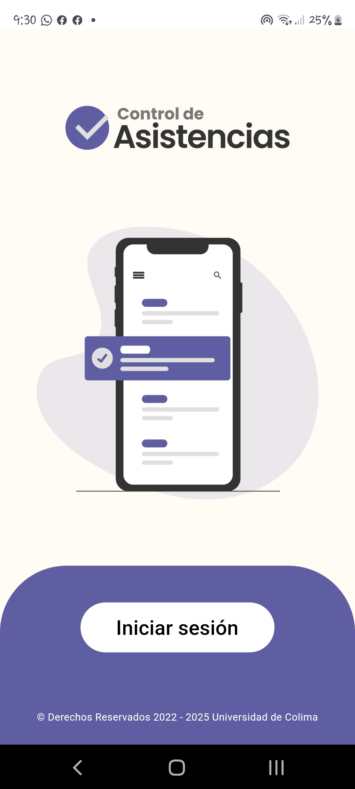
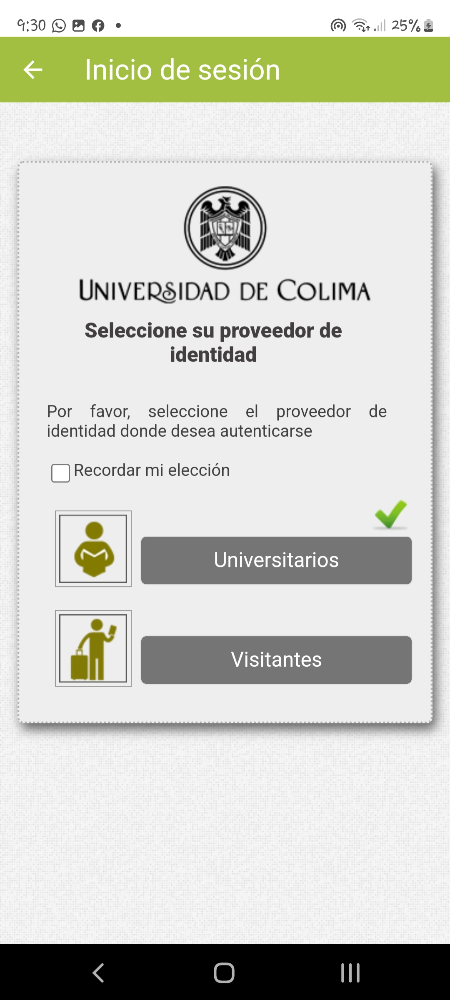
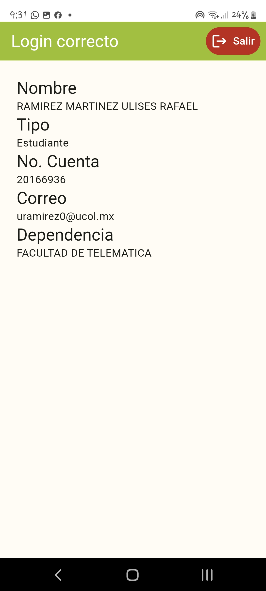

# wayf_login_udc

Aplicación que funciona como plantilla y package para la autenticación federada para la universidad de colima
Se proveen las screens necesarias para un login con el sistema SIMPLESAML de la universidad de colima

# Breaking change

El repositorio en la versión 2.x.x fue migrado a la versión 3.7.x de flutter y 2.18.x de dart, así como el upgrade de los paquetes usados.

Revisa compatibilidades antes de hacer un upgrade.

## Contenido

### WayfLoginButtonScreen

Provee de una pantalla antes de **WayfWebViewScreen** con la capacidad de recibir un title (requerido) y un logo (opcional) que serán mostrados la parte superior y central de la pantalla respectivamente.

En este ejemplo se usó el titulo y logo para la aplicación de control de asistencias.



### WayfWebViewScreen

Provee el widget que se conecta a la federación, recibe un callback que es llamado al recibir los datos de la federación



### LoginResultScreen

Una pantalla provisional para mostrar la información obtenida en el login con la posibilidad de cerrar la sesión actual.



### Constantes

Se exporta las clases abstractas de **UdcColors** con los colores usados en el diseño y pueden ser usados para otras aplicaciones.

## Uso

Aumenta la minSdkVersion a la 19

```gradle
defaultConfig {
    minSdkVersion 19
}
```

### Plantilla

Puedes usar este repositorio desde github o accediendo a este [link](https://github.com/Universidad-de-Colima/demo-flutter-login-federado/generate)

Este repositorio es una aplicación completa que puedes correr ejecutando el proyecto desde el archivo main.dart.

Contiene los iconos para android y una aplicación de entrada en app.dart

```bash
flutter run
```

### Package

En tu pubspec.yaml agrega la siguiente dependencia

```yaml
wayf_login_udc:
    git:
        url: https://github.com/Universidad-de-Colima/demo-flutter-login-federado.git
        ref: main
```

Importa el paquete en donde necesites usar los widget **WayfWebViewScreen**
**WayfLoginButtonScreen**

```dart
import 'package:wayf_login_udc/wayf_login_udc.dart';
```

## For developers

Occasionally run

```bash
dart format --fix -l 80 lib
flutter pub run import_sorter:main
```

Or if you're using fvm

```bash
dart format --fix -l 80 lib
fvm flutter pub run import_sorter:main
```

This commands are in the script format.sh, in UNIX-like systems just run

```bash
chmod +x ./format.sh
./format.sh
```

## Más información

Federación de Identidades de la Universidad de Colima

- [Federación UCOL](https://portal.ucol.mx/federacion-identidades/) - Página oficial
