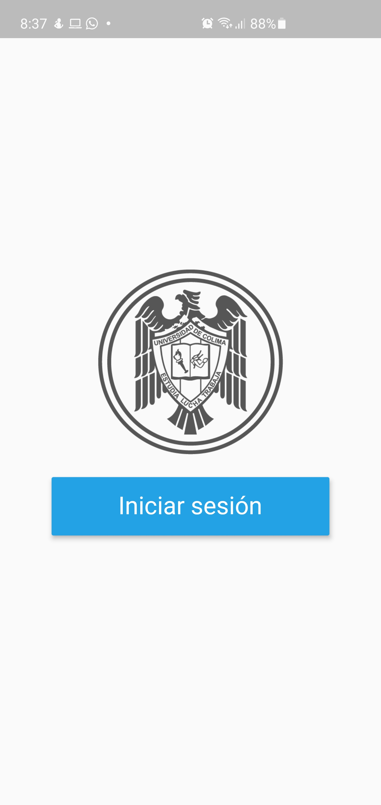
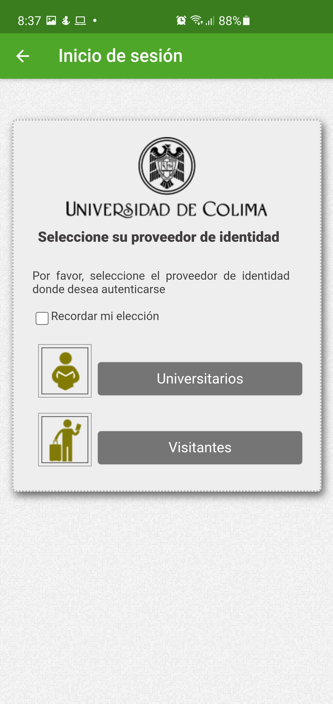
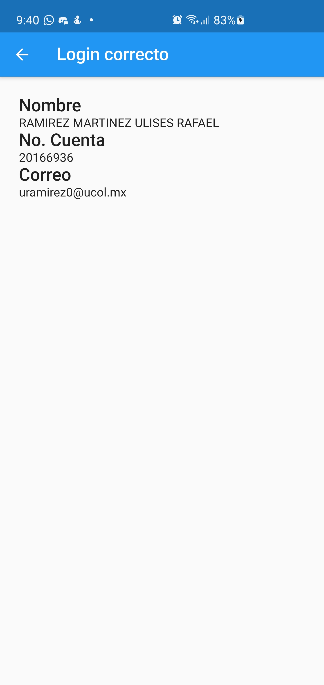

# wayf_login_udc

Aplicación que funciona como plantilla y package para la autenticación federada para la universidad de colima
Se proveen las screens necesarias para un login con el sistema SIMPLESAML de la universidad de colima

## Contenido

### WayfLoginButtonScreen

Provee de una pantalla antes de **WayfWebViewScreen** con el logo de la universidad y un botón que abre la pagina de la federación



### WayfWebViewScreen

Provee el widget que se conecta a la federación, recibe un callback que es llamado al recibir los datos de la federación



### LoginResultScreen

Una pantalla provisional para mostrar la información obtenida en el login



## Uso

### Plantilla

Puedes usar este repositorio desde github o accediendo a este [link](https://github.com/Universidad-de-Colima/demo-flutter-login-federado/generate)

Este repositorio es una aplicación completa que puedes correr ejecutando

Contiene los iconos para android y una aplicación de entrada en app.dart

```bash
flutter run
```

### Package

En tu pubspec.yaml agrega la siguiente dependencia

```yaml
wayf_login_udc:
    git:
        url: https://github.com/Universidad-de-Colima/demo-flutter-login-federado.git
        ref: main
```

Importa el paquete en donde necesites usar los widget **WayfWebViewScreen**
**WayfLoginButtonScreen**

```dart
import 'package:wayf_login_udc/wayf_login_udc.dart';
```

## For developers

Occasionally run

```bash
dart format --fix -l 80 lib
flutter pub run import_sorter:main
```

Or if you're using fvm

```bash
dart format --fix -l 80 lib
fvm flutter pub run import_sorter:main
```

## Más información

Federación de Identidades de la Universidad de Colima

-   [Federación UCOL](https://portal.ucol.mx/federacion-identidades/) - Página oficial
